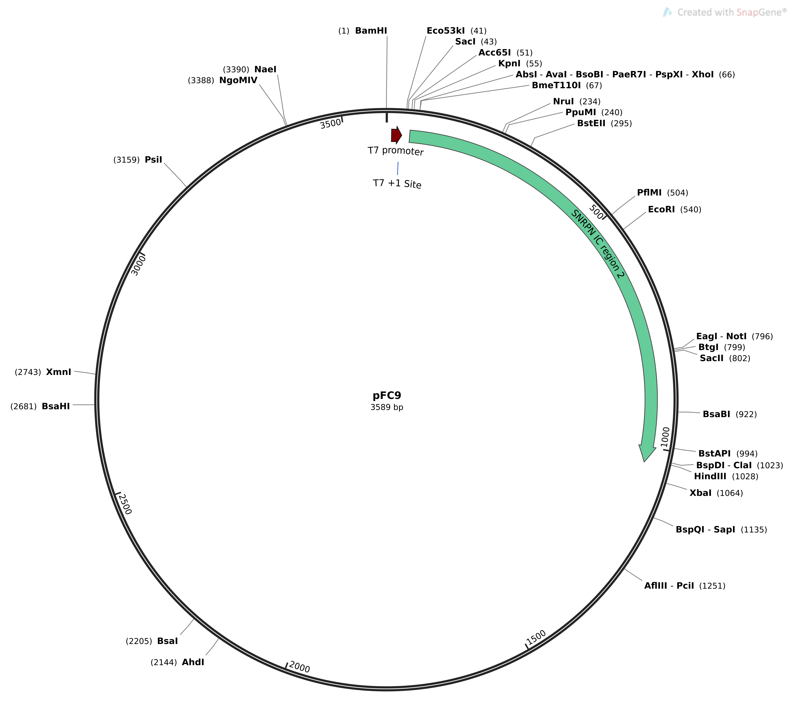
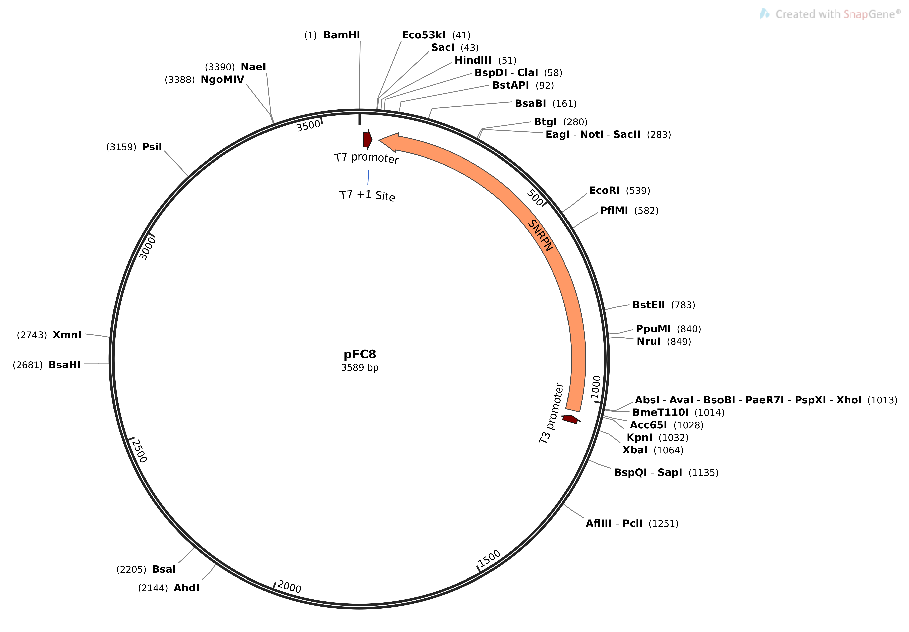

Background
==========

R-loops are prevalent, functionally important, non-B DNA structures that
form co-transcriptionally when the nascent RNA strand hybridizes back to
the DNA template forming a DNA-RNA hybrid [@chedin_nascent_2016].
R-loops are formed ubiquitously across the genomes of all organisms
often occupying large fractions of the genomes in a cell population.

{#fig:1 width="12cm"}

R-loops have been shown to cover approximately 5% of the human genome,
and generally, their formation is favored by regions with high GC skew
(overabundance of G over C nucleotides) and GC content (percentage of G
and C nucleotides) as the potential DNA-RNA hybrids formed over these
sequences tend to be more energetically favorable with respect to R-loop
formation[@Stolz2019]. Beyond these broad associations there has been
little investigation into the specific sequence characteristics that
influence R-loop initiation and termination, representing a significant
gap in knowledge that continues to become increasingly pressing as the
recognized scope of these structure's impact on cellular functions
continues to grow. Here, I describe a detailed strategy for the
systematic investigation of the impact of DNA sequence on R-loop
initiation and termination which seeks to implement the methods
described by Vazquez, Chedin and Natasa in NSF proposal number 2054347.

Insert design
=============

The overall goal of this series of experiments is to transcribe
carefully controlled DNA sequences, referred to as inserts, in order to
systematically observe the effects of these controlled sequences on
R-loop initiation and termination *in vitro*. Inserts are composed of
two types of DNA components; the variable and infrastructure regions.
The variable region is the sequence of interest with respect to R-loop
formation while infrastructure sequences are additional nucleotide
blocks that allow for the insertion of variable regions into specific
plasmid backbones in a modular fashion. The distinct regions that
compose each insert are described below.

{#figure:1
width="16cm"}

5' homology arm and KpnI recognition site
-----------------------------------------

The first 30 bp of each insert will be composed of the 5' homology arm
and a KpnI recognition site. These sequences are included to facilitate
Gibson and restriction enzyme cloning into pFC9 and pFC8 respectively.
These 30 bp are taken directly from nucleotides 27 - 56 of pFC9.

{#fig:homology_5
width="12cm"}

This strategy will mean recognition sites for Eco53KI, SacI and Acc65I
will be included in the 5' homology arms. However, none of these enzymes
will be utilized in any cloning protocols and so only the KpnI site is
noted in diagrams.

### Anchor region

The anchor region serves as a constant 15 nucleotide sequence that is
always present in any final assembled construct adjacent to the 5' end
of the variable region. This region provides significant utility when
attempting to clone inserts already present in a plasmid into an
alternative backbone. As long as the anchor region is present and
intact, the number of primers required to amplify the insert region will
not be dependent on the number of variable regions but the number of
unique backbones. This utility is more explicitly shown in sections
[3.3](#sec:tac-init){reference-type="ref" reference="sec:tac-init"} and
[3.4](#sec:tac-termination){reference-type="ref"
reference="sec:tac-termination"}.

Since this region is intended to be used as part of a PCR primer it was
selected from candidate random sequences that satisfied the requirements
below.

-   Does not contain any common sub-strings of minimum length equal to
    75% of the anchor's own length with any variable region or plasmid
    backbone.

-   Does not contain the recognition sites for any restriction enzyme
    used in any relevant cloning procedure (see table
    [3](#tab:enzymes){reference-type="ref" reference="tab:enzymes"}).

-   Does not contain single stretches of single nucleotides greater than
    three nucleotides in length.

### Variable regions

Each insert will contain 1 variable region designed to test the effects
of different sequence properties, namely GC / AT skew, GC content and G
/ C clustering, on R-loop initiation and termination. Each variable
region will be 200 bp in length and 31 different variable regions with
the properties described in table [1](#table:1){reference-type="ref"
reference="table:1"} will ultimately be synthesized.

::: {#table:1}
  name      GC skew   GC content   AT skew G cluster length
  ------- --------- ------------ --------- ------------------
  VR-1          0.0          0.4       0.0 NA
  VR-2          0.0          0.5       0.0 NA
  VR-3          0.0          0.6       0.0 NA
  VR-4          0.0          0.7       0.0 NA
  VR-5          0.1          0.4       0.0 NA
  VR-6          0.1          0.5       0.0 NA
  VR-7          0.1          0.6       0.0 NA
  VR-8          0.1          0.7       0.0 NA
  VR-9          0.2          0.4       0.0 NA
  VR-10         0.2          0.5       0.0 NA
  VR-11         0.2          0.6       0.0 NA
  VR-12         0.2          0.7       0.0 NA
  VR-13         0.4          0.4       0.0 NA
  VR-14         0.4          0.5       0.0 NA
  VR-15         0.4          0.6       0.0 2
  VR-16         0.4          0.6       0.0 3
  VR-17         0.4          0.6       0.0 4
  VR-18         0.4          0.6       0.0 NA
  VR-19         0.4          0.6       0.2 2
  VR-20         0.4          0.6       0.2 3
  VR-21         0.4          0.6       0.2 4
  VR-22         0.4          0.6       0.2 NA
  VR-23         0.4          0.6       0.4 2
  VR-24         0.4          0.6       0.4 3
  VR-25         0.4          0.6       0.4 4
  VR-26         0.4          0.6       0.4 NA
  VR-27         0.4          0.7       0.0 NA
  VR-28         0.6          0.4       0.0 NA
  VR-29         0.6          0.5       0.0 NA
  VR-30         0.6          0.6       0.0 NA
  VR-31         0.6          0.7       0.0 NA

  : Properties of all variable regions. NA in the G cluster length
  column indicates that the guanines are un-clustered. G clusters were
  distributed so that an equal number of nucleotides was present between
  each cluster.
:::

Each variable region is designed so that it may be used to test sequence
effects on R-loop initiation when oriented in the same direction as a
proximal promoter and R-loop termination when oppositely oriented to an
upstream promoter. The properties of the reverse complements,
representing transcription of variable regions in the reverse
orientation, are listed in table [2](#table:2){reference-type="ref"
reference="table:2"}.

::: {#table:2}
  name      GC skew   GC content   AT skew C cluster length
  ------- --------- ------------ --------- ------------------
  VR-1          0.0          0.6       0.0 NA
  VR-2          0.0          0.5       0.0 NA
  VR-3          0.0          0.4       0.0 NA
  VR-4          0.0          0.3       0.0 NA
  VR-5         -0.1          0.6       0.0 NA
  VR-6         -0.1          0.5       0.0 NA
  VR-7         -0.1          0.4       0.0 NA
  VR-8         -0.1          0.3       0.0 NA
  VR-9         -0.2          0.6       0.0 NA
  VR-10        -0.2          0.5       0.0 NA
  VR-11        -0.2          0.4       0.0 NA
  VR-12        -0.2          0.3       0.0 NA
  VR-13        -0.4          0.6       0.0 NA
  VR-14        -0.4          0.5       0.0 NA
  VR-15        -0.4          0.4       0.0 2
  VR-16        -0.4          0.4       0.0 3
  VR-17        -0.4          0.4       0.0 4
  VR-18        -0.4          0.4       0.0 NA
  VR-19        -0.4          0.4      -0.2 2
  VR-20        -0.4          0.4      -0.2 3
  VR-21        -0.4          0.4      -0.2 4
  VR-22        -0.4          0.4      -0.2 NA
  VR-23        -0.4          0.4      -0.4 2
  VR-24        -0.4          0.4      -0.4 3
  VR-25        -0.4          0.4      -0.4 4
  VR-26        -0.4          0.4      -0.4 NA
  VR-27        -0.4          0.3       0.0 NA
  VR-28        -0.6          0.6       0.0 NA
  VR-29        -0.6          0.5       0.0 NA
  VR-30        -0.6          0.4       0.0 NA
  VR-31        -0.6          0.3       0.0 NA

  : Properties of the reverse complements of all variable regions
  described in table [1](#table:1){reference-type="ref"
  reference="table:1"}
:::

. [\[table:2\]]{#table:2 label="table:2"}

While the global sequence properties for each variable region are well
defined, properties such as GC-skew, content or nucleotide clustering do
not determine which particular nucleotide should occur at a specific
position in a given sequence. In this way, the parameters that define
and separate each variable region can be thought of as bounding the set
of all possible nucleotide sequences of length 200. In order to select
one specific sequence from this set we can sample a large number of
sequences and access each one with metrics relevant to the realities of
cloning protocols and R-loop formation. Each metric used to access
candidate variable regions are described below. All metrics received
equal weight in final candidate selection.

![Visualization of sequence selection for an example variable region.
Here, 100 candidate variable region sequences were generated and then
ranked based on four metrics; mean R-loop probability (MRLP), mean local
average energy (MLAE), proportion of nucleotides predicted to
participate in RNA hairpins (PH) and proportion of nucleotides predicted
to be unpaired (PUP). Sequences were by each individual metric (A) and
an overall rank was calculated by selecting the candidate with the
lowest average rank (B). The candidate with the best (lowest) overall
rank was then selected as the final
sequence.](images/plots/VR-1.all_ranked.png){#ranking width="18cm"}

#### Restriction enzyme recognition sites

It is critical that the inserts are not cut unexpectedly within the
variable region by any of the restriction enzymes used as a part of
cloning protocols. Accordingly, before passing on for further downstream
analysis candidate variable regions containing any of the recognition
sites listed in table [3](#tab:enzymes){reference-type="ref"
reference="tab:enzymes"} were removed from consideration.

::: {#tab:enzymes}
  Enzyme    Recognition sequence
  --------- ----------------------
  KnpI      GGTACC
  EcoRI     GAATTC
  HindIII   AAGCTT
:::

#### Predicted R-loop probability

Previous Chedin lab member Dr. Robert Stolz developed Rlooper, a physics
based equilibrium model for predicting the probability of R-loop
formation over a given DNA sequence [@Stolz2019]. Rlooper output
includes a predicted probability of R-loop formation at each base in the
input sequence, and the calculated average free energy (local average
energy) from all simulated R-loops overlapping that particular
nucleotide. Since for this analysis, we prefer to select variable
regions that are more likely to form R-loops, candidate variable regions
with high mean R-loop formation probability and low mean local average
energy are preferred and receive higher rankings.

{#fig:rlooper-expect
width="14cm"}

Both local average energy and somewhat consequentially, mean R-loop
probability are sensitive to both the GC skew and content of the input
sequence (fig [5](#fig:rlooper-expect){reference-type="ref"
reference="fig:rlooper-expect"}). Comparing between sequences generated
with the same parameters and therefore GC skew and content ensures that
we are mainly evaluating how the arrangement of a particular set of
nucleotides is predicted in generally effect the likelihood of R-loop
formation.

#### RNA secondary structure

Significant amounts of RNA secondary structure, especially large
hairpins, are expected to reduce the likelihood of R-loop formation by
causing competition for binding to the nascent RNA strand between itself
and the DNA template. To avoid selecting sequences that are predicted to
form an anomalous degree of RNA secondary structure SPOT-RNA rNA
secondary structure prediction program in conjunction with the bpRNA
structure annotation program [@Singh2019; @Danaee2018] were used to
calculate the estimated proportion of ribonucleotides in a given
transcribed variable region that would participate in hairpin structures
(PH) and the estimated proportion that would remain unpaired (PUP).
Candidate variable regions with low PH and high PUP were preferred.

{#fig:rna_secondary_structure
width="14cm"}

### EcoRI site and 3' homology arm

The final 30 nucleotides of each insert will be composed of a EcoRI
recognition site (6 bp) and the 3' homology arm (24 bp).

{#fig:3_prime_arm
width="10cm"}

Both the 5' homology arm + KpnI site and EcoRI site + 3' homology arm
were produced using the Jupyter notebook available [at this
link](https://github.com/EthanHolleman/plasmid-VR-design/blob/main/notes/homology_arms.ipynb).

Assembly of DNA inserts
=======================

Complete insert sequences will be cloned into three different plasmid
backbones: pFC9 (fig [9](#fig:map_pFC8){reference-type="ref"
reference="fig:map_pFC8"}), pFC8 (fig
[9](#fig:map_pFC8){reference-type="ref" reference="fig:map_pFC8"}), and
pFC53tacT$_1$T$_2$ (fig [10](#fig:map_pFC53tacT1T2){reference-type="ref"
reference="fig:map_pFC53tacT1T2"}). pFC9 will be utilized for testing
R-loop initiation, pFC8 for R-loop termination and pFC53tacT$_1$T$_2$
for multiple and single-round transcription versions of both initiation
and termination experiments with Tac polymerase.

{#fig:map_pFC9
width="8cm"}

{#fig:map_pFC8
width="11cm"}

{#fig:map_pFC53tacT1T2
width="8cm"}

T7 initiation series constructs {#T7:init}
-------------------------------

{#clone:T7-insert
width="15cm"}

First, pFC9 will be linearized by digestion with KpnI and EcoRI (fig
[11](#clone:T7-insert){reference-type="ref"
reference="clone:T7-insert"}A). The large pFC9 fragment will then be
purified via agarose gel and added to a mixture containing all insert
sequences in equal molar concentrations (fig
[11](#clone:T7-insert){reference-type="ref"
reference="clone:T7-insert"}B). Next, T5 exonuclease is added to digest
the 5' ends of all DNA in the mixture. This will leave the 3' overhang
of the digested KpnI site intact but degrade the 5' overhang of EcoRI
(fig [11](#clone:T7-insert){reference-type="ref"
reference="clone:T7-insert"}C). The 5' ends of the insert will also be
degraded, exposing the complete KnpI and EcoRI sites. Next, during
Gibson assembly the 5' homology arm and KnpI site will anneal to the
pFC9 large fragment, overhanging the digested KnpI site by 1 nucleotide.
Similarly, the 3' homology arm and intact EcoRI site of the inserts will
anneal to the pFC9 large fragment, with only the last nucleotide (C) of
the insert's intact EcoRI site annealing to the 3' G present at the
digested EcoRI site of the pFC9 large fragment (fig
[11](#clone:T7-insert){reference-type="ref"
reference="clone:T7-insert"}D). This will result in a library of
circular constructs with all inserts located downstream of and oriented
forward relative to, the pFC9 T7 promoter (fig
[11](#clone:T7-insert){reference-type="ref"
reference="clone:T7-insert"}).

{#clone:T7-insert-simulated
width="12cm"}

### Assembly protocol

A Jupyter notebook for calculating the volumes of individual inserts,
digested pFC9 backbone and Gibson assembly master mix to complete the
Gibson assembly protocol outlined in fig
[12](#clone:T7-insert-simulated){reference-type="ref"
reference="clone:T7-insert-simulated"} is available at this link. At the
time of writing the concentration of pFC9 fragment and the
concentrations of individual inserts are unknown and placeholder values
that must be updated are currently used. All volumes and concentrations
of reagents are derived from [New England Biolabs Gibson assembly
recommendations](https://www.neb.com/protocols/2012/12/11/gibson-assembly-protocol-e5510).

T7 termination series constructs
--------------------------------

After the successful sequencing of the T7 initiation series, pFC8 will
be utilized as the backbone for construction of the termination series
library.

{#clone:T7-term
width="15cm"}

First, the strongest and most consistent R-loop initiator identified
from the T7 initiation series will serve as the substrate for an
additional synthetic double stranded DNA fragment containing the strong
initiator sequence flanked by HindIII and EcoRI recognition sequences
([13](#clone:T7-term){reference-type="ref" reference="clone:T7-term"}A).
This strong initiator fragment will be added to pFC8
([13](#clone:T7-term){reference-type="ref" reference="clone:T7-term"}B)
and then the mixture digested with HindIII and EcoRI. The strong
initiator will then anneal to the large pFC8 fragment via homology
between the digested HindIII and EcoRI recognition sites
([13](#clone:T7-term){reference-type="ref" reference="clone:T7-term"}C).
Next all termination inserts will be added to the pFC8-strong-initiator
construct in equal molar ratios
([13](#clone:T7-term){reference-type="ref" reference="clone:T7-term"}D)
and the mixture digested with KpnI and EcoRI
([13](#clone:T7-term){reference-type="ref" reference="clone:T7-term"}E).
Inserts will then be incorporated into pFC8-strong-initiator constructs
via homology between the digested KpnI and EcoRI sites
([13](#clone:T7-term){reference-type="ref" reference="clone:T7-term"}F).
Since the order of these recognition sites on the pFC8-strong-initiator
construct is opposite to that of the insert with respect to the T7
promoter the inserts will be present in the final construct in the
reverse orientation and place the variable region downstream of the
strong initiator ([13](#clone:T7-term){reference-type="ref"
reference="clone:T7-term"}G).

was used in its
place.](images/plasmid_maps/T7_term_VR-1 Map.png){#clone:T7-term-insert-simulated
width="12cm"}

Tac initiation series constructs {#sec:tac-init}
--------------------------------

{width="15cm"}

First primers two pairs of primers are used to add amplify the anchor
region, variable region, EcoRI recognition site and extension region
from the T7 initiation construct library
([3.3](#sec:tac-init){reference-type="ref" reference="sec:tac-init"}).
These primers will also contain overhangs with homology to the 5' end of
the tac promoter and 3' T1T2 terminator sequences
([\[T7:tac-init\]](#T7:tac-init){reference-type="ref"
reference="T7:tac-init"}A). Next, pFCT$_1$T$_2$ is separately digested
with HindIII and KpnI and the large fragment is purified via agarose
gel. The PCR products products are added to the large fragment and
digested with T5 endonuclease
([\[T7:tac-init\]](#T7:tac-init){reference-type="ref"
reference="T7:tac-init"}B, C). The final construct is assembled via
Gibson assembly and the HindIII and KpnI sites are regenerated as a
result of the insertion.

{width="15cm"}

### Tac initiation series primer design

{#fig:y equals x width="75%"}

{#fig:three sin x width="75%"}

{#fig:three sin x
width="75%"}

        |95°C|95°C               |    |tmf:73.4
        |____|_____          72°C|72°C|tmr:78.5
        |5min|30s  \ 64.4°C _____|____|45s/kb
        |    |      \______/ 0:59|5min|GC 55%
        |    |       30s         |    |1318bp

Tac termination series constructs {#sec:tac-termination}
---------------------------------

The assembly protocol for the tac termination series is identical to the
initiation series, the difference being the insert is sourced from T7
termination series constructs and accordingly a different set of primers
is utilized to amplify the insert region and add homology for Gibson
assembly into pFCT$_1$T$_2$.

{width="15cm"}

{width="15cm"}

### Tac termination series primer design

{#fig:y equals x width="75%"}

{#fig:three sin x width="75%"}

{#fig:three sin x
width="75%"}

A PCR program is not included here as an placeholder initiation region
was used to demonstrate how tac termination series primers would be
designed. Therefore until an actual strong initiator region is
determined and verified these primers should *not* be ordered. Code to
generate both initiation and termination series primers and PCR programs
is available as a Jupyter notebook [at this
link](https://github.com/EthanHolleman/plasmid-VR-design/blob/main/notes/tac_series_primers.ipynb).
This was later converted into a functionally equivalent notebook that is
run as part of the insert calculation pipeline.

Validation of insert libraries
------------------------------

Since all inserts of a given series will be assembled into their
respective backbone in the same pot, it will be necessary to confirm
that each insert-backbone assembly are present in relatively equal
concentrations in the final library. Since the variable region of each
insert-backbone assembly will be unique, qPCR utilizing primers that
target a subset or all variable regions can be utilized to measure
relative insert-backbone concentrations in the library. Potential
primers for each insert are available at this link.

Quantification of R-loop formation 
----------------------------------

Short description of SMRF-seq protocol using barcoded PCR primers for
amplification and anticipated data analysis.

Reagents and kits
-----------------

-   [NEB Gibson assembly master
    mix](https://www.neb.com/products/e2611-gibson-assembly-master-mix#Product%20Information_Properties%20&%20Usage)

-   [NEB High-Fidelity DNA
    Polymerase](https://www.neb.com/products/m0491-q5-high-fidelity-dna-polymerase#Product%20Information)

-   [QIAquick gel extraction
    kit](https://www.qiagen.com/us/products/discovery-translational-research/dna-rna-purification/dna-purification/dna-clean-up/qiaquick-gel-extraction-kit/#orderinginformation/).

-   [DpnI](https://www.neb.com/products/r0176-dpni?__cf_chl_jschl_tk__=d22d8cb49b9b2d4ff2532de61875fea36af4066f-1626291600-0-ARBMmni5PdhcCrqckk9zN05YGR50cB-otICbDTrUStRYlPQzdrbyJvjEOoI2QusMU-HOcKBcontIQfQRYoQqN9R2hNCL0XzFa2hP3-_c6Vf1sL2Sb2Bs_DXW38t8Oc1NxSg0caQ4FlAGqVNswAJaml9BhLC5dWj1sCuqKwDj72JKO8eI9d3mlCcNVIAVs8n1xFpuo1_oyafffkTnQ-ysv358pg1RrIbChfkwqXctDQennQm_CRjVjuitrXFFNjgAqBDJBKFRMZKkoOYlTDEDBsuaQaQtMxNwL5u7yIJ5mNCrkkuiikIGg7Was3tNj1d7D-7bnJrfXr8jIfG3qW6kvIkrZBJey0JQAVMQGVc4Ps0t0_iS3P4ahcZRytZezR6Fq9lrMqGJkB_Xmxyr0cVoXrbIv136yLISC-RPNR4MDWXe#Product%20Information),
    optionally use for digesting plasmid DNA after amplication of
    inserts

Additional resources
--------------------

-   [NEB Gibson assembly
    protocols](https://www.neb.com/applications/cloning-and-synthetic-biology/dna-assembly-and-cloning/gibson-assembly)

-   [Janet B. Matsen: Open Wet Ware Gibson
    assembly](https://openwetware.org/wiki/Janet_B._Matsen:Guide_to_Gibson_Assembly)

Code availability
=================

All code used in insert creation and analysis [is available
here](https://github.com/EthanHolleman/plasmid-VR-design). The source
code for this document is available [at this
link](https://github.com/EthanHolleman/VR-cloning-protocol).

Sequence availability
=====================

All sequence data is available as a part of the insert region
calculation pipeline and can be found [at this
link](https://github.com/EthanHolleman/plasmid-VR-design/releases/tag/v1.0).

Supplementary materials
=======================

NEB Restriction enzyme activities
---------------------------------

  Enzyme       1.1   2.1   3.1    CutSmart
  ------------ ----- ----- ------ ----------
  EcoRI        25    100   50     50
  EcoRI-HF     10    100   \<10   100
  KpnI         100   75    \<10   50
  KpnI-HF      100   25    10     100
  HindIII      25    100   50     50
  HindIII-HF   10    100   100    100

Snakemake workflow diagram
--------------------------

{width="15cm"}

Initial R-looper expectation calculations
-----------------------------------------

{width="15cm"}
